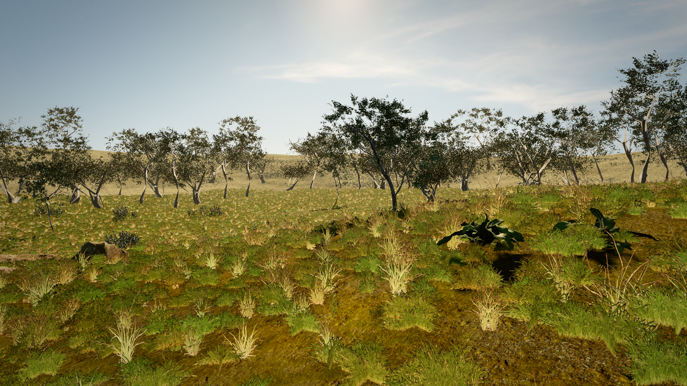

# Camping World — photoreal Three.js scene

A first-person camping clearing built with Three.js, aiming for a "reads as
real" golden-hour look (RDR2-style mood): rolling dry meadow, photoscanned
trees and deadwood, a stone fire pit with ash and charcoal, and ~130k
instanced grass cards swaying in the wind.



## Run it

```bash
cd camping-world
npm install
npm run dev          # http://localhost:5173
```

Click the screen to lock the pointer, then:

| Input        | Action            |
| ------------ | ----------------- |
| `W A S D`    | walk              |
| `Shift`      | sprint            |
| mouse        | look              |
| `Esc`        | release pointer   |

The player walks at 2.2 m/s (4.8 m/s sprint) at a 1.7 m eye height, follows
the terrain, head-bobs subtly, and collides with trunks, boulders and camp
props.

## How it's built

- **Terrain** — seeded-noise heightfield cupped into a bowl so the rim +
  treeline close the horizon. Three photoscanned ground sets (grass / leaf
  litter / mud) splat-blended in a custom `onBeforeCompile` shader with
  two-scale de-tiling and macro tint noise.
- **Sky & light** — Poly Haven `autumn_field_puresky` HDRI (IBL + background,
  HDR-clamped and mipmapped) plus a measured-azimuth DirectionalLight sun
  (4096² PCF shadows) and exp2 aerial haze.
- **Vegetation** — optimized photoscan trees in three LOD tiers (hero ≤60 m,
  mid at clearing edge, instanced far ring closing the horizon), instanced
  shrubs/ferns/nettles understory, and 130k wind-animated grass cards
  baked from photoscanned clumps into an atlas (`scripts/bake-grass.mjs`).
- **Campsite** — photoscanned stone fire pit with a lumpy ash mound and
  charcoal chunks, split-log firewood heap, fallen-log seat, chopping stump
  with hatchet, crate + lantern.
- **Post** — SMAA, N8AO, bloom, warm-shadow split-tone grade, vignette, grain
  (pmndrs `postprocessing` + `n8ao`).

### The one weird lesson

A pale washed-out band across the mid-distance survived four iterations of
albedo/fog darkening. Root cause (found by pixel-measuring a grass-stripped
render): **grazing-angle specular** — at horizontal sightlines Fresnel → 1 and
the terrain + grass cards mirror the bright sky/sun. Matte ground needs its
`directSpecular`/`indirectSpecular` killed in-shader; no albedo value can
out-darken a sky reflection.

## Asset pipeline (already run; outputs are committed)

```bash
npm run fetch-assets      # downloads Poly Haven models/textures/HDRIs
npm run optimize-assets   # gltf-transform: weld → simplify per-LOD → WebP → meshopt
node scripts/bake-grass.mjs   # renders grass clumps into the card atlas
```

## Self-play harness (how the look was iterated)

```bash
npm run shots -- --iter 21               # all 6 fixed views → PNG + stats JSON
npm run shots -- --iter x --views 3      # single view
npm run shots -- --iter x --query "nograss=1"   # layer isolation
node scripts/test-movement.mjs           # deterministic FP-controller tests
```

Screenshots are captured with system Chrome + SwiftShader (software WebGL2),
so they run on GPU-less CI boxes. `src/debug/harness.js` defines the fixed
viewpoints; `window.__READY` gates capture; renderer stats accumulate across
all composer passes.

Useful debug query params: `?shot=1` (freeze wind + fixed cams), `?px=0.5`
(render scale), `?hdri=…`, `?sunel/?sunaz/?sunint/?env/?fog/?exp` (lighting
overrides), `?nograss/?noveg/?nogeo/?nopost` (layer isolation),
`?grassboost=N` (card brightness A/B).

## Credits

All assets are CC0 from [Poly Haven](https://polyhaven.com):

- **HDRIs** — autumn_field_puresky (used), belfast_sunset_puresky,
  kloppenheim_02_puresky (A/B alternates).
- **Ground textures** — aerial_grass_rock, forest_leaves_03,
  brown_mud_leaves_01, forrest_ground_01.
- **Models** — island_tree_01/02, tree_small_02, searsia_lucida, fir_sapling,
  fir_sapling_medium, shrub_01/02/03, fern_02, nettle_plant, dandelion_01,
  grass_medium_01/02, grass_bermuda_01, dead_tree_trunk, dead_tree_trunk_02,
  tree_stump_01, dry_branches_medium_01, bark_debris_01, stone_fire_pit,
  boulder_01, rock_07, rock_moss_set_01, namaqualand_boulder_02,
  sand_rocks_small_01, hatchet, wooden_axe, wooden_lantern_01,
  wooden_crate_01.
